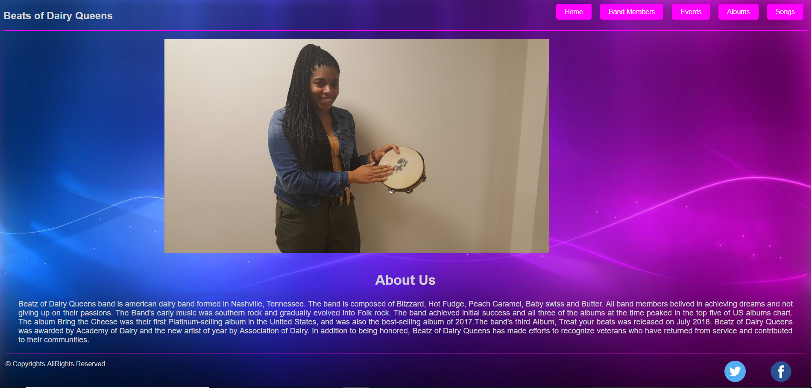

# bandz-dairy-queens

This project was our first collaborated effort in github. We built a web page to host our band data. It has the following pages. 

<ul>
<li>Home Page - done by Ripal Patel</li>
<li>Band Members Page - done by Mary West</li>
<li>Tour/Event Page - done by Michelle Beshears</li>
<li>Album Page - done by Aftan Walls</li>
<li>Song Page - done by Jasmine Walters</li>
</ul>

## How to run this project
* Use npm to install http-server in your terminal:
```sh
npm install -g http-server
```
* Run the server
```sh
hs -p 9999
```
* Open chrome and navigate to:
```
localhost:9999
```

## Screenshots

